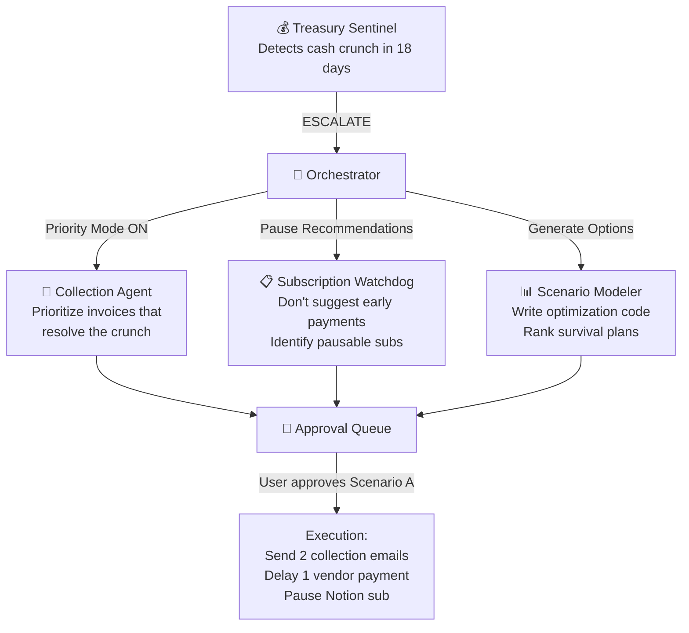

# 🚀 Titus-Prime (Can be renamed later) — Your Autonomous Financial Operations Agent

## The Unified Product Narrative

> _"One agent. Every financial operation. You just approve."_

---

## The Story: Meet Alex

Alex is the founder of **CloudMetrics**, a growing B2B SaaS startup. 200 customers. 15 US states. $85K MRR. No CFO. No finance team. Alex IS the finance team.

Every month, Alex drowns in financial operations:

| Task                                                     |     Time Burned     | Pain Level |
| -------------------------------------------------------- | :-----------------: | :--------: |
| Chasing 12 overdue invoices with manually written emails |       3 hours       |     😤     |
| Checking which SaaS tools are about to auto-renew        |       2 hours       |     😰     |
| Calculating sales tax obligations per state              |       4 hours       |     🤯     |
| Checking if they'll make payroll in 2 weeks              |       1 hour        |     😱     |
| Figuring out if they crossed a new state's tax nexus     |       2 hours       |     💀     |
| **Total repetitive financial operations**                | **12+ hours/month** |            |

Last quarter, three things went catastrophically wrong:

1. **💸 Slack Enterprise auto-renewed for $14,400** — Alex missed the 30-day cancellation window by 2 days
2. **🏛️ Texas sent a compliance notice** — CloudMetrics crossed the sales tax nexus 3 months ago and never filed
3. **💀 Payroll almost bounced** — Alex didn't see the cash crunch coming until 3 days before payday. Scrambled to collect invoices at the last minute.

**Alex doesn't need another dashboard. Alex doesn't need another spreadsheet. Alex needs an agent that handles all of this autonomously and only asks for approval when something matters.**

**Enter FinPilot.**

---

## What Is FinPilot?

FinPilot is an **AI-native financial operations autopilot** for SaaS founders and small finance teams. It connects to your financial data and deploys **six specialized AI agents** that work 24/7:

- 🔭 **Watching** your cash position and predicting crunches weeks ahead
- 📨 **Chasing** overdue invoices with context-aware collection campaigns
- 📋 **Tracking** every SaaS subscription renewal, price escalation, and termination window
- 🏛️ **Monitoring** multi-state sales tax nexus thresholds and pre-filling tax returns
- 📊 **Modeling** scenarios when financial pressure is detected
- 💻 **Writing custom code** for YOUR specific data — not a one-size-fits-all template

**The human only touches FinPilot for approvals.** Everything else runs autonomously.

---

## The Agentic Architecture

```
┌────────────────────────────────────────────────────────────────────────────┐
│                         FINPILOT DASHBOARD                                │
│                                                                           │
│  ┌──────────┐  ┌──────────┐  ┌──────────┐  ┌──────────┐  ┌──────────┐   │
│  │ Treasury │  │Collection│  │Subscript.│  │   Tax    │  │ Scenario │   │
│  │  Panel   │  │  Panel   │  │  Panel   │  │  Panel   │  │  Panel   │   │
│  └──────────┘  └──────────┘  └──────────┘  └──────────┘  └──────────┘   │
│                                                                           │
│           [ APPROVAL QUEUE — Items needing your sign-off ]                │
└────────────────────────────┬───────────────────────────────────────────────┘
                             │
                             ▼
┌────────────────────────────────────────────────────────────────────────────┐
│                     🧠 ORCHESTRATOR AGENT (The Brain)                     │
│                                                                           │
│  • Routes data to the right sub-agent                                     │
│  • Prioritizes actions by urgency & financial impact                      │
│  • Manages the human approval queue                                       │
│  • Coordinates cross-agent workflows                                      │
│    (e.g., "Cash crunch detected → trigger Collection Agent urgently")     │
│                                                                           │
│  Engine: Gemini 2M context (via Inference Gateway)                        │
└──────┬──────────┬──────────┬──────────┬──────────┬────────────────────────┘
       │          │          │          │          │
       ▼          ▼          ▼          ▼          ▼
┌──────────┐ ┌──────────┐ ┌──────────┐ ┌──────────┐ ┌──────────────────┐
│ 💰       │ │ 📨       │ │ 📋       │ │ 🏛️       │ │ 📊               │
│ TREASURY │ │COLLECTION│ │SUBSCRIPT.│ │   TAX    │ │ SCENARIO         │
│ SENTINEL │ │& RECEIV. │ │& VENDOR  │ │COMPLIANCE│ │ MODELER          │
│ AGENT    │ │ AGENT    │ │ WATCHDOG │ │ AGENT    │ │ AGENT            │
└──────────┘ └──────────┘ └──────────┘ └──────────┘ └──────────────────┘
       │          │          │          │          │
       └──────────┴──────────┴──────────┴──────────┘
                             │
                             ▼
              ┌──────────────────────────────┐
              │   💻 CODEX ENGINE            │
              │   (Shared Code Gen Layer)    │
              │                              │
              │   Writes & executes custom   │
              │   Python scripts for each    │
              │   business's unique data     │
              │                              │
              │   Runs in E2B Sandbox        │
              │   (secure, isolated)         │
              └──────────────────────────────┘
```

---

## The Six Agents — Deep Dive

### Agent 1: 💰 Treasury Sentinel

**Mission:** Never let a cash crunch surprise you again.

| Attribute        | Detail                                                                                                                                                                                           |
| ---------------- | ------------------------------------------------------------------------------------------------------------------------------------------------------------------------------------------------ |
| **Ingests**      | Bank balance (mock Plaid feed), outstanding invoices (AR), upcoming bills (AP), payroll schedule, recurring subscriptions                                                                        |
| **Runs**         | Continuously — recalculates the 30-day forward projection every time new data arrives                                                                                                            |
| **Codex Writes** | Custom Python forecasting scripts using pandas: time-series projection of daily cash balance factoring in expected inflows (invoices due) and confirmed outflows (bills, payroll, subscriptions) |
| **Detects**      | Projected balance dropping below a configurable safety floor (e.g., $5,000)                                                                                                                      |
| **Triggers**     | When crunch detected → (1) Alerts Orchestrator → (2) Orchestrator escalates Collection Agent to priority mode → (3) Scenario Modeler generates response plans                                    |

**What the user sees:**

```
┌──────────────────────────────────────────────────────────┐
│  ⚠️  CASH ALERT — Projected shortfall in 18 days        │
│                                                          │
│  Current balance: $32,400                                │
│  Payroll (Day 15): -$22,000                              │
│  Bills due (Day 12-18): -$14,200                         │
│  Expected inflows: +$8,600                               │
│  Projected Day 18 balance: -$3,200 ❌                    │
│                                                          │
│  📊 3 survival scenarios generated → [View Scenarios]    │
└──────────────────────────────────────────────────────────┘
```

**Human-in-the-Loop Moment:** Approving which survival scenario to execute.

---

### Agent 2: 📨 Collection & Receivables Agent

**Mission:** Get paid without lifting a finger.

| Attribute                | Detail                                                                                                                                                             |
| ------------------------ | ------------------------------------------------------------------------------------------------------------------------------------------------------------------ |
| **Ingests**              | Invoice data (amounts, due dates, customers), customer payment history, aging report                                                                               |
| **Runs**                 | Daily — scans for newly overdue invoices and updates follow-up sequences                                                                                           |
| **Codex Writes**         | Customer segmentation scripts (who pays late habitually vs. one-time delays), email tone calibration logic                                                         |
| **Escalation Ladder**    | Day 1 overdue → Friendly reminder · Day 7 → Firm follow-up · Day 14 → Urgent notice · Day 30 → Final notice with consequences                                      |
| **Smart Prioritization** | In normal mode: follows standard ladder. In **crisis mode** (triggered by Treasury Sentinel): prioritizes the specific invoices that would resolve the cash crunch |

**What the user sees:**

```
┌──────────────────────────────────────────────────────────┐
│  📨 COLLECTION QUEUE — 5 actions ready                   │
│                                                          │
│  🔴 Invoice #1042 — Acme Corp — $8,200 (14 days late)   │
│     [View Draft Email]  [Approve & Send]  [Edit]         │
│                                                          │
│  🟡 Invoice #1038 — TechFlow — $3,400 (7 days late)     │
│     [View Draft Email]  [Approve & Send]  [Edit]         │
│                                                          │
│  🟢 Invoice #1055 — DataSync — $1,800 (1 day late)      │
│     [View Draft Email]  [Approve & Send]  [Edit]         │
│                                                          │
│  [Approve All]  [Review All First]                       │
└──────────────────────────────────────────────────────────┘
```

**Draft email example (tone-aware):**

> Subject: Quick reminder — Invoice #1042 ($8,200)
>
> Hi Sarah,
>
> Hope all's well at Acme! Just a quick nudge that Invoice #1042 for $8,200 (issued April 3) is now 14 days past the Net-30 term. I know these things slip through the cracks — could you check with your AP team when we can expect payment?
>
> Happy to jump on a quick call if there's anything to discuss.
>
> Best, Alex

**Human-in-the-Loop Moment:** Reviewing and approving each collection email before it sends. Can edit tone, add personal notes, or dismiss.

---

### Agent 3: 📋 Subscription & Vendor Watchdog

**Mission:** Never lose money to a renewal you forgot about.

| Attribute        | Detail                                                                                                                                                    |
| ---------------- | --------------------------------------------------------------------------------------------------------------------------------------------------------- |
| **Ingests**      | SaaS subscription data (names, costs, billing cycles, renewal dates), vendor invoices with payment terms                                                  |
| **Runs**         | Daily — checks countdown timers against configurable alert windows (45 days, 30 days, 14 days, 7 days before renewal)                                     |
| **Tracks**       | Auto-renewal dates, cancellation windows, price escalation schedules, early termination penalties, early-payment discount deadlines (e.g., "2/10 Net-30") |
| **Codex Writes** | Comparative analysis scripts: "Is this SaaS tool's usage worth its cost?" based on user-provided usage data. Generates cost-benefit calculations.         |

**What the user sees:**

```
┌──────────────────────────────────────────────────────────┐
│  📋 SUBSCRIPTION ALERTS — 3 upcoming actions             │
│                                                          │
│  🔴 URGENT — Slack Enterprise ($14,400/yr)               │
│     Auto-renews in 8 days. Cancel window closes in 2d.   │
│     Agent drafted cancellation email.                    │
│     [View Email]  [Send Cancellation]  [Keep Subscription]│
│                                                          │
│  🟡 WATCH — AWS Reserved Instances                       │
│     Price escalation: +12% effective July 1              │
│     Agent modeled alternatives.                          │
│     [View Analysis]  [Draft Renegotiation]  [Accept]     │
│                                                          │
│  🟢 OPTIMIZE — Vendor X (Net-30 invoice, $6,200)        │
│     Early payment discount: 2% if paid within 10 days   │
│     Savings: $124. Days remaining: 6                     │
│     [Approve Early Payment]  [Pay on Net-30]             │
└──────────────────────────────────────────────────────────┘
```

**Cross-Agent Coordination:** When Treasury Sentinel detects a crunch, the Watchdog pauses early-payment discount recommendations and instead identifies subscriptions that could be temporarily paused to free up cash.

**Human-in-the-Loop Moment:** Approving cancellations, renegotiation emails, or early payment decisions.

---

### Agent 4: 🏛️ Tax Compliance Agent

**Mission:** Handle multi-state SaaS sales tax without an accountant.

| Attribute        | Detail                                                                                                                                                                                                                                               |
| ---------------- | ---------------------------------------------------------------------------------------------------------------------------------------------------------------------------------------------------------------------------------------------------- |
| **Ingests**      | Transaction data by state (customer addresses, revenue amounts), SaaS product categories, state tax rate databases                                                                                                                                   |
| **Runs**         | Continuously — monitors cumulative revenue per state against nexus thresholds                                                                                                                                                                        |
| **Codex Writes** | (1) State-specific tax calculation scripts (different states tax SaaS differently — some exempt, some tax at full rate, some only tax if "delivered electronically"). (2) Form-filling scripts that map calculated values to tax return form fields. |
| **Detects**      | When a new state crosses the economic nexus threshold (typically $100K revenue or 200 transactions)                                                                                                                                                  |

**The Tax Compliance Workflow — Step by Step:**

```
 BACKGROUND MONITORING (runs silently)
 ──────────────────────────────────────
 │
 │  Transaction data flows in from Stripe/payment feed
 │  Agent tallies cumulative revenue per state
 │
 │  State Tracker:
 │  ┌────────────┬──────────┬───────────┬──────────┐
 │  │ State      │ Revenue  │ Threshold │ Status   │
 │  ├────────────┼──────────┼───────────┼──────────┤
 │  │ California │ $142,000 │ $500,000  │ ✅ Safe  │
 │  │ Texas      │ $98,200  │ $100,000  │ ⚠️ 98%  │
 │  │ New York   │ $67,000  │ $100,000  │ 🟢 67%  │
 │  │ Florida    │ $0       │ N/A       │ No Tax   │
 │  └────────────┴──────────┴───────────┴──────────┘
 │
 ▼
 🚨 THRESHOLD CROSSED — Texas hits $100K
 ──────────────────────────────────────
 │
 │  Agent triggers:
 │  1. Determines Texas SaaS tax classification
 │     (Texas: SaaS is taxable as "data processing service" at 6.25%)
 │
 │  2. Codex writes a Python script to:
 │     - Filter all Texas transactions from the dataset
 │     - Apply the 6.25% rate
 │     - Calculate total tax owed: $1,420.50
 │     - Generate line items per month
 │
 │  3. Agent fetches the Texas Comptroller Sales Tax Return template
 │     Codex writes a form-mapping script:
 │     - Maps calculated values to form fields
 │     - Generates a pre-filled return (visual preview)
 │
 ▼
 🧑 HUMAN-IN-THE-LOOP — Approval Required
 ──────────────────────────────────────
 │
 │  Dashboard shows:
 │  "🏛️ NEW — Texas Sales Tax nexus crossed.
 │   Tax owed: $1,420.50. Return pre-filled.
 │   [Preview Return]  [Approve Filing]  [Flag for Accountant]"
 │
 │  Alex reviews the visual return → Clicks [Approve Filing]
 │
 ▼
 ✅ MOCK SUBMISSION
 ──────────────────────────────────────
    Agent logs the filing, updates the compliance calendar,
    and schedules the next quarterly return.
```

**Human-in-the-Loop Moment:** Reviewing the pre-filled tax return and approving the filing. Can also flag for external accountant review.

---

### Agent 5: 📊 Scenario Modeler

**Mission:** When pressure hits, show the options — ranked by math, not gut feeling.

| Attribute        | Detail                                                                                                                                                                                                                                                                                     |
| ---------------- | ------------------------------------------------------------------------------------------------------------------------------------------------------------------------------------------------------------------------------------------------------------------------------------------ |
| **Triggered By** | Treasury Sentinel (when cash crunch detected)                                                                                                                                                                                                                                              |
| **Codex Writes** | Constraint optimization scripts using `scipy.optimize` or `PuLP`. Variables: which invoices to prioritize collecting, which vendor payments to delay, which subscriptions to pause. Constraints: maintain minimum bank balance, don't delay critical vendors, don't pause essential tools. |
| **Outputs**      | 3 ranked scenarios with probability-weighted outcomes                                                                                                                                                                                                                                      |

**Example Output:**

```
┌──────────────────────────────────────────────────────────┐
│  📊 SCENARIO ANALYSIS — Cash crunch in 18 days           │
│                                                          │
│  SCENARIO A — Recommended (92% success probability)      │
│  ├─ Collect: Invoice #1042 (Acme, $8,200)               │
│  ├─ Collect: Invoice #1038 (TechFlow, $3,400)            │
│  ├─ Delay: Vendor X payment by 7 days                    │
│  ├─ Result: +$4,100 buffer on Day 18                     │
│  └─ [Execute This Plan]                                  │
│                                                          │
│  SCENARIO B — Conservative (85% success)                 │
│  ├─ Collect: All 5 overdue invoices ($14,800)            │
│  ├─ Pause: Notion subscription ($240/mo)                 │
│  ├─ Result: +$7,540 buffer on Day 18                     │
│  └─ [Execute This Plan]                                  │
│                                                          │
│  SCENARIO C — Aggressive (78% success)                   │
│  ├─ Collect: Invoice #1042 only ($8,200)                 │
│  ├─ No vendor delays                                     │
│  ├─ Result: +$600 buffer on Day 18 (tight)               │
│  └─ [Execute This Plan]                                  │
└──────────────────────────────────────────────────────────┘
```

**When the user clicks [Execute This Plan]:**

- Collection Agent immediately generates and queues the prioritized collection emails
- Vendor Watchdog drafts the payment delay request
- Subscription Watchdog queues the pause instruction
- All presented as a unified approval queue

---

### Agent 6: 💻 Codex Engine (The Shared Brain)

**Mission:** Write the code that no template can.

This isn't a separate "feature" — it's the **engine underneath every other agent**. Every agent uses the Codex Engine to:

1. **Read the user's specific data schema** — column names, data types, business-specific fields
2. **Write custom Python scripts** — pandas transformations, calculations, visualizations
3. **Execute in E2B sandbox** — secure, isolated, no risk to user data
4. **Return structured results** — numbers, charts, and actionable outputs

**Why this matters for Codex Usage (20 points):**
The agents don't use hard-coded financial logic. They WRITE financial logic on-the-fly for each unique business. This means:

- A SaaS company's data looks different from a consulting firm's data
- The agent adapts by writing different code for each
- This is Codex being used as a **computational engine**, not a chatbot

---

## The Complete Story — Demo Script

### Act 1: Setup (30 seconds)

> _"Meet Alex, founder of CloudMetrics. 200 customers, 15 states, no CFO. Alex spends 12 hours a month on financial operations that should be automated. Let's connect FinPilot to Alex's financial data."_

**Demo action:** Upload 3 CSV files (transactions, invoices, subscriptions) → FinPilot ingests them in seconds.

### Act 2: The Agents Go To Work (90 seconds)

> _"FinPilot deploys six specialized agents. Watch what happens."_

**The dashboard populates in real-time:**

1. **Treasury Sentinel** lights up: _"⚠️ Cash crunch projected in 18 days. Payroll + bills exceed projected inflows by $3,200."_

2. **Collection Agent** activates: _"5 invoices are overdue. Collection emails drafted for each, tone-matched to customer relationship."_

3. **Subscription Watchdog** flags: _"🔴 Slack Enterprise auto-renews in 8 days. Cancellation window closes in 2 days. Cancellation email drafted."_

4. **Tax Compliance** alerts: _"🏛️ Texas nexus crossed. $98,200 → threshold is $100K. Tax owed: $1,420.50. Return pre-filled."_

5. **Scenario Modeler** generates: _"3 scenarios to resolve the cash crunch. Scenario A: Collect 2 invoices + delay 1 vendor = safe with $4,100 buffer."_

### Act 3: The Human-in-the-Loop (60 seconds)

> _"Alex opens the approval queue. Five items. Each one requires a single click."_

**Demo action — Alex approves:**

1. ✅ Scenario A — Collection emails for Invoice #1042 and #1038 are queued
2. ✅ Slack cancellation email — Sent
3. ✅ Texas tax return — Filed
4. ✅ TechFlow collection email — Sent with a personal note added
5. ✅ Early payment for Vendor Y — Pay now, save $124

> _"Total time: 4 minutes. Previously: 12+ hours per month. FinPilot doesn't replace Alex's judgment — it does the work and asks for Alex's approval. That's the future of financial operations."_

---

## Cross-Agent Intelligence — What Makes This Special

The agents don't work in isolation. **The Orchestrator coordinates them:**



**This is the key differentiator.** Individual financial tools exist. But an **orchestrated multi-agent system where one agent's detection triggers coordinated responses from other agents** — that's genuinely new.

---

## Hackathon Winning Angle — Why Judges Will Score This High

### Technical Execution (25 pts) — ⭐⭐⭐⭐⭐

- Multi-agent orchestration with real inter-agent communication
- Dynamic code generation (Codex Engine) running in sandboxed environment
- Not one agent — SIX coordinated agents with distinct responsibilities

### Usefulness (25 pts) — ⭐⭐⭐⭐⭐

- Solves 4 painful financial operations problems in one product
- Saves 12+ hours/month for every SaaS founder (millions of potential users)
- Each agent solves a problem that currently requires either an expensive SaaS tool or a dedicated finance person

### Creativity & Originality (20 pts) — ⭐⭐⭐⭐⭐

- No open-source agentic version of this exists (verified in audit)
- The cross-agent coordination (Treasury → Collection escalation) is genuinely novel
- Combines 4 financial domains that are always treated as separate products

### Codex Usage (20 pts) — ⭐⭐⭐⭐⭐

- Codex is the ENGINE, not a wrapper
- Every agent writes custom Python for the user's specific data
- Tax calculation code, optimization models, forecasting scripts — all generated on-the-fly
- The user sees code being written and executed in real-time (the "wow" moment)

### Presentation Clarity (10 pts) — ⭐⭐⭐⭐⭐

- The Alex story creates emotional connection
- Three-act demo structure: Setup → Agents Work → Human Approves
- Every judge will immediately understand: "This replaces my part-time finance person"

---

## Tech Stack

| Layer               | Technology                            | Why                                                              |
| ------------------- | ------------------------------------- | ---------------------------------------------------------------- |
| **Frontend**        | Next.js + Vanilla CSS                 | Premium dark-mode dashboard with real-time updates               |
| **Backend**         | FastAPI (Python)                      | Async agent orchestration, WebSocket for live updates            |
| **LLM Engine**      | Inference Gateway (Gemini 2M primary) | Free, 5 load-balanced spaces, massive context for data ingestion |
| **Code Execution**  | E2B Sandbox (free tier)               | Secure Python execution for Codex-generated scripts              |
| **Data Storage**    | SQLite (local for hackathon)          | Simple, no infrastructure needed                                 |
| **Agent Framework** | LangGraph or custom state machine     | Multi-agent orchestration with state management                  |
| **Mock APIs**       | Stripe (test mode), Plaid Sandbox     | Realistic financial data feeds                                   |

---

## What We DON'T Build (Scope Control)

> [!WARNING]
> **Hackathon rule: Narrow but useful. Ship early. Don't overbuild.**

| In Scope (MVP)                         | Out of Scope                 |
| -------------------------------------- | ---------------------------- |
| CSV upload for all financial data      | Real bank API integration    |
| Treasury projection (30 days)          | Historical trend analysis    |
| Collection email generation + preview  | Actual email sending         |
| Subscription renewal tracking + alerts | Real SaaS API integrations   |
| Tax nexus monitoring + return pre-fill | Actual tax filing submission |
| Scenario modeling (3 scenarios)        | Custom scenario builder      |
| Single unified dashboard               | Mobile app                   |
| Mock Stripe webhook data               | Real payment processing      |

**The demo uses mock data that tells a compelling story. The architecture is real. The agents are real. The code generation is real. The mock data makes it demonstrable.**

---

## 7-Day Build Plan

| Day             | Phase       | Deliverables                                                                                                                                         |
| --------------- | ----------- | ---------------------------------------------------------------------------------------------------------------------------------------------------- |
| **Mon (Day 1)** | Foundation  | Project scaffolding (Next.js + FastAPI), Inference Gateway integration, E2B sandbox setup, data models for invoices/subscriptions/transactions       |
| **Tue (Day 2)** | Core Agents | Treasury Sentinel + Collection Agent working end-to-end with mock data. Codex Engine writing and executing Python scripts in sandbox.                |
| **Wed (Day 3)** | Checkpoint  | Subscription Watchdog + Tax Compliance Agent. Dashboard UI with all 5 panels. **Submit: Product brief, investor one-pager, screenshots, user flow.** |
| **Thu (Day 4)** | Polish      | Scenario Modeler. Cross-agent orchestration (Treasury → Collection escalation). Approval queue workflow.                                             |
| **Fri (Day 5)** | Ship        | Demo video recording. Public launch post. Bug fixes. **Submit: Working prototype, demo walkthrough, launch post.**                                   |
| **Sat-Sun**     | Buffer      | Polish, practice demo, gather feedback                                                                                                               |
