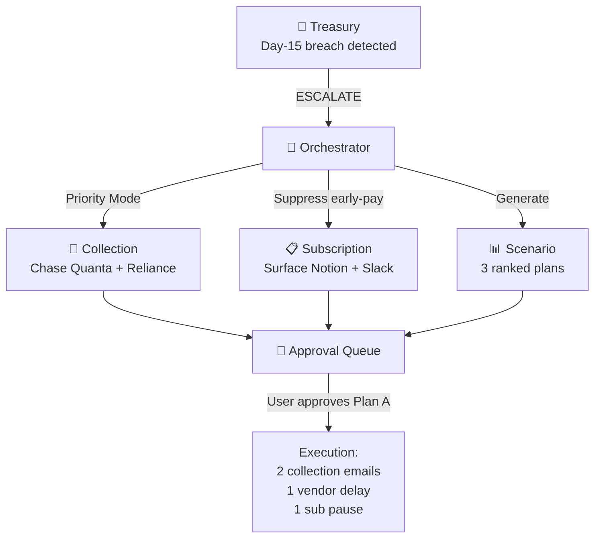

# 🚀 Titus-Prime — Your Autonomous Financial Operations Agent

> _"Your finance team is a codebase. Codex writes it. You own it."_

---

## The Story: Meet Alex (US) and Aarav (India)

**Alex** is the founder of **CloudMetrics**, a B2B SaaS startup. 200 customers. 15 US states. ~$85K MRR. No CFO. Alex IS the finance team.

**Aarav** runs **CloudMetrics India Pvt Ltd**, the Indian arm. 12 employees on Indian payroll. GST filings. Razorpay invoices in INR. Tally for accounting.

Both share the same problem: financial operations sprawl across 10+ SaaS tools — Stripe, Plaid, Salesforce, QuickBooks, Tally, Razorpay, Gmail, Outlook, Slack, Teams. Nobody hand-uploads CSVs at 11pm. They need a system that **reads the source of truth wherever it lives** and **acts only when it must**.

Last quarter, three things went catastrophically wrong:

1. **💸 Slack Enterprise auto-renewed for $14,400** — Alex missed the 30-day cancellation window by 2 days
2. **🏛️ Texas sent a compliance notice** — CloudMetrics crossed sales-tax nexus 3 months ago and never filed
3. **💀 Indian payroll almost bounced** — payroll lands on Day 15; cash dropped to -$1,566 because the recovery on Quanta's $48k invoice never came in

**Enter Titus-Prime.**

---

## What Is Titus-Prime?

Titus-Prime is an **AI-native financial operations cockpit** for SaaS companies operating across **US (USD) and India (INR)**. Open the Boardroom and the system has already:

- 🔌 **Synced** every connected source (Stripe, Plaid, Salesforce, QuickBooks, Tally, Razorpay, Gmail, Outlook, Slack, Teams, Zoho)
- 📊 **Built a 30-day solvency forecast** with Standby (do-nothing) vs. Autopilot (with-action) modes
- 🚨 **Surfaced the breach** — projected day, projected balance, agent-value delta
- 📨 **Drafted the human-readable artifacts** — collection emails, renewal calendars, tax previews, scenario plans
- ❓ **Made every number queryable** through Ask Mode — a CFO Q&A grounded in the live snapshot

**The human only touches Titus-Prime for approvals.** Everything else runs autonomously inside the Policy Envelope.

---

## The Killer Feature — A Living, Versioned Financial Codebase

Three reinforcing capabilities, presented as one concept:

### 1. Connector-Driven Truth (replaces hand-uploaded CSVs)

The Boardroom hydrates from **11 connectors** at launch. Every financial number on screen has a connector source.

| Region           | Source                    | What it brings                                  |
| ---------------- | ------------------------- | ----------------------------------------------- |
| US / Global      | Stripe                    | Customer invoices, charges, refunds (USD + INR) |
| US / Global      | Plaid (real sandbox path) | Bank balances + transactions                    |
| US / Global      | Salesforce                | Enterprise AR + account health                  |
| US               | QuickBooks                | Booked AR/AP, journal entries, vendor terms     |
| US / IN / Global | Gmail                     | Inbox-parsed invoices, renewals                 |
| US / IN / Global | Outlook                   | M365 inbox + calendar invoice signals           |
| US / IN / Global | Slack                     | Approval pings to finance channels              |
| US / IN / Global | Teams                     | Enterprise approval channels                    |
| India            | Razorpay                  | UPI / NetBanking / cards / payouts              |
| India            | Tally                     | Indian GL, GST registers, vendor masters        |
| India            | Zoho Books                | Indian SaaS accounting + invoicing              |

**Plaid has a real sandbox path** — set `PLAID_CLIENT_ID` + `PLAID_SECRET` and Titus-Prime hits the live Plaid sandbox for real account balances. Every other connector ships with deterministic fixtures shaped exactly like the real API responses, so swapping in OAuth keys later is a one-line change.

CSV remains as a one-off fallback (a tiny "Other sources" drawer) — not the primary entry point.

### 2. Two-Mode Solvency Forecast (Standby vs. Autopilot)

The Treasury Sentinel chart shows **two lines** simultaneously:

- 🔴 **Standby** — what happens if you take no action (the dry-run line)
- 🟢 **Autopilot** — what happens if you approve the recommended scenario

The shaded area between them is the **agent value** — the dollar amount Titus-Prime saves by acting. A glide cursor with vertical guide reveals per-day microanalysis on hover. Two markers light up automatically:

- **LAG** — the lowest projected balance on Standby (where you fail without help)
- **GAIN** — the day with the largest delta vs. Standby (where the agent earns its keep)

A live demo run with the connector data shows: **Day-15 breach to -$1,566 · Standby end-of-month $4,405 · Autopilot end-of-month $59,370 · Agent value +$54,965**.

### 3. Human-Readable Artifacts + Per-Agent Customization

Click any agent's "view artifact" badge and you get the **output**, not the script:

- **Collection** → editable tone-aware email template with merge fields
- **Subscription** → renewal calendar with cancel-now / keep cards
- **Tax** → pre-filled return preview with line items + state-law citation
- **Scenario** → three ranked plan cards
- **Treasury** → editable assumption knobs (floor, payroll date, recovery %)

Each artifact has an **inline customization input**: "soften the tone for enterprise customers", "add VAT to filings", "exclude Tatva Cloud from auto-collection". The instruction is persisted to `agent_customizations` and **injected into the agent's system prompt on the next run** — Codex Prime literally regenerates the skill with your guidance.

The Python file still exists (versioned, exportable as `.zip`) but lives behind a small "Show technical detail" disclosure — not the headline.

### 4. Policy Envelope (replaces approve-everything)

The user defines pre-approved action _classes_ once. Sample envelope:

```yaml
auto_actions:
  - "Send collection reminders ≤ $1,000 / ≤ ₹85,000 to customers ≤ 14 days late"
  - "Pause optional subscriptions ≤ $300/mo when cash buffer < $10k"
  - "Pre-pay vendors when discount > 1.5% AND cash buffer > $25k"

always_escalate:
  - "Tax filings (any state, any country, any amount)"
  - "Subscription cancellations > $5k/yr or > ₹4L/yr"
  - "Vendor payment delays"
  - "Collection actions > $1,000 / > ₹85,000"
```

Agents act inside the envelope autonomously and only interrupt the human on breaches.

### 5. Ask Mode — the CFO Q&A panel

A single panel inside the Boardroom: ask any financial question, get a grounded, structured answer. The LLM receives the entire canonical snapshot as ground truth and returns:

- A direct numerical lead sentence
- 3–5 bullet highlights citing exact USD / INR figures
- Up to 7 cited figures (label → value pairs)

Sample questions: _"What's our 30-day cash runway?"_, _"Who's the largest overdue customer?"_, _"What single action saves us the most cash this month?"_, _"Where am I most exposed on tax?"_.

---

## The Agentic Architecture

```
┌──────────────────────────────────────────────────────────────────────────┐
│                          TITUS-PRIME UI                                  │
│  ┌──────────────  BOARDROOM  ──────────────┐  ┌── WORKSHOP ──┐          │
│  │ ConnectionsPanel (11 sources, auto-sync)│  │ Live Codex   │          │
│  │ TreasurySection (Standby/Autopilot)     │  │ Skill Library│          │
│  │ AskMode  (CFO Q&A)                      │  └──────────────┘          │
│  │ AgentArtifact ×5  (humans, not scripts) │                            │
│  │ AgentConsole + ApprovalQueue            │                            │
│  └─────────────────────────────────────────┘                            │
└────────────────────────────┬─────────────────────────────────────────────┘
                             ▼  (SSE: streaming events + tokens)
┌──────────────────────────────────────────────────────────────────────────┐
│              🧠 ORCHESTRATOR (LangGraph state machine)                   │
│  • Reads the canonical snapshot                                          │
│  • Reads per-agent customizations and injects them into prompts          │
│  • Enforces Policy Envelope                                              │
│  • Coordinates cross-agent escalations                                   │
└──────┬──────────┬──────────┬──────────┬──────────┬──────────────────────┘
       │          │          │          │          │
       ▼          ▼          ▼          ▼          ▼
┌──────────┐ ┌──────────┐ ┌──────────┐ ┌──────────┐ ┌──────────┐
│ Treasury │ │Collection│ │Subscript.│ │   Tax    │ │ Scenario │
│ Sentinel │ │& Receiv. │ │ Watchdog │ │Compliance│ │ Modeler  │
└─────┬────┘ └────┬─────┘ └────┬─────┘ └────┬─────┘ └────┬─────┘
      └───────────┴────────────┼────────────┴────────────┘
                               ▼
                    ┌──────────────────────────┐
                    │   💻 Codex Prime         │
                    │   • Selects engine       │
                    │   • Applies customization│
                    │   • Generates Python     │
                    │   • Versions in skill lib│
                    └────────────┬─────────────┘
                                 │
                                 ▼
              ┌──────────────────────────────────────┐
              │       LLM CASCADE (3 engines)        │
              │   1. Gemini 2.5 Flash    (primary)   │
              │   2. Groq llama-3.3-70b  (fallback)  │
              │   3. OpenAI Codex        (tertiary)  │
              └──────────────────┬───────────────────┘
                                 ▼
              ┌──────────────────────────────────────┐
              │        CONNECTOR REGISTRY            │
              │  Stripe · Plaid · Salesforce ·       │
              │  QuickBooks · Tally · Zoho ·         │
              │  Razorpay · Gmail · Outlook ·        │
              │  Slack · Teams                       │
              └──────────────────────────────────────┘
```

---

## The Six Agents

Each agent is a **real agent**: persona, tool palette, memory, escalation rules, dedicated skill subdirectory, **and a user-editable customization** persisted in `agent_customizations`.

### 1. 🔭 Treasury Sentinel

- **Reads:** `banks` + `outflows` + `inflows` from the canonical snapshot
- **Outputs:** 30-day Standby + Autopilot projections, breach detection, recommended scenario
- **Cross-agent:** broadcasts `ESCALATE: cash_crunch_detected` → triggers Collection priority + Subscription pause-scan + Scenario Modeler

### 2. 📨 Collection & Receivables

- **Reads:** all overdue inflows, customer payment history, Salesforce account health
- **Outputs:** tone-aware draft emails (USD or INR), prioritized chase list
- **Crisis mode:** when Treasury escalates, reorders the chase list to maximize recoverable cash that resolves the projected shortfall

### 3. 📋 Subscription & Vendor Watchdog

- **Reads:** subscriptions across Slack/Teams/AWS/Datadog/Zoho/Notion/Linear feeds
- **Outputs:** renewal calendar, cancel-now alerts, early-pay discount tracking
- **Crisis mode:** suppresses early-pay recommendations, surfaces pausable subs

### 4. 🏛 Tax Compliance

- **Reads:** per-state US revenue + Indian GST register
- **Outputs:** nexus monitoring (CA, TX, NY, FL), pre-filled US returns, GST quarterly previews
- **Risk mitigation:** every classification is backed by an editable Python skill — accountants can read, fix, re-run

### 5. 📊 Scenario Modeler

- **Triggered by:** Treasury escalations or manual user request
- **Outputs:** 3 ranked survival plans (success probability, buffer gain, rationale)

### 6. 💻 Codex Prime

- Shared coding agent. Reads the active customization for the calling agent and injects it into the prompt before generating. The user's instruction _literally shapes_ the output.

---

## Cross-Agent Intelligence



---

## The 3-Act Demo (~3 minutes)

### Act 1 — Cockpit Hydration (45s)

> _"Open the Boardroom. No buttons clicked yet."_

Eleven connector tiles flash green as the auto-sync runs. Cash KPI populates with USD + INR cross-converted total ($36,455). AR aging, AP, monthly subs all populate. The Treasury operational-caution banner fires: **"Cash shortfall projected in 15 days · $6,566 below floor."**

### Act 2 — Standby vs. Autopilot (60s)

Click the Treasury chart's **Autopilot** mode. The line shifts from red to green; the area between them shades emerald. Glide the cursor across:

- **Day 0:** $36,455 (today)
- **Day 15:** Standby drops to -$1,566; Autopilot stays at $14k
- **Day 30:** Standby ends at $4,405; Autopilot ends at $59,370

The **agent value KPI strip** at the bottom: **+$54,965**. The story tells itself.

### Act 3 — Ask, Approve, Customize (75s)

**Ask Mode:** _"What single action saves us the most cash this month?"_ — Gemini answers in 1.3s with the chase recommendation, two highlights, and four cited figures.

**AgentArtifact (Collection):** click → see the actual email template (firm tone, $8,200 invoice). Type into the customization input: _"Soften the tone for enterprise customers above $25k ARR."_ Hit Apply.

**Approve queue:** approve scenario A. Watch Collection Agent re-draft the Quanta email with the softer tone. Watch Subscription Watchdog pause Notion. Watch Codex commit two new skill versions. Skill library grows from 12 to 14 entries.

End: click **Export Codebase**. A `.zip` of real Python files downloads. _"This is your finance codebase. Codex wrote it. You own it. It runs every day."_

---

## Tech Stack

| Layer            | Technology                                                                                                | Why                                                    |
| ---------------- | --------------------------------------------------------------------------------------------------------- | ------------------------------------------------------ |
| **Frontend**     | React 19 + TanStack Start + Tailwind + shadcn/ui (dark)                                                   | Two-pane Boardroom + Workshop, motion/react animations |
| **Backend**      | TanStack Start server routes (Nitro)                                                                      | Async fan-out + SSE streaming                          |
| **Orchestrator** | LangGraph state machine (in-process)                                                                      | Cross-agent coordination, Policy Envelope              |
| **Primary LLM**  | **Gemini 2.5 Flash** via Google AI Studio direct                                                          | Fast, free tier, OpenAI-compatible                     |
| **Fallback LLM** | **Groq llama-3.3-70b-versatile**                                                                          | <500ms first-token; takes over on Gemini rate-limit    |
| **Tertiary LLM** | OpenAI Codex (env-key gated)                                                                              | Activates the moment `CODEX_API_KEY` is present        |
| **Sandbox**      | E2B (free tier)                                                                                           | Secure isolated Python execution (planned wire)        |
| **Connectors**   | Stripe, Plaid (real sandbox), Salesforce, QuickBooks, Tally, Zoho, Razorpay, Gmail, Outlook, Slack, Teams | Real adapter interfaces with deterministic fixtures    |
| **Currency**     | USD + INR with FX-aware totals (lakh / crore formatting)                                                  | Demo for both US and Indian SaaS founders              |
| **Skill repo**   | Real git-shaped Supabase rows + zip export                                                                | Versioned, exportable, owned by user                   |
| **Storage**      | Supabase (skills, approvals, policies, agent_customizations)                                              | Realtime channels, RLS, single env var                 |

---

## What We DON'T Build (Scope Control)

| In Scope (MVP)                                                 | Out of Scope                        |
| -------------------------------------------------------------- | ----------------------------------- |
| 11 connectors with deterministic fixtures + real Plaid sandbox | OAuth flows for every connector     |
| Standby/Autopilot 30-day projection                            | Multi-year financial planning       |
| Collection email **drafts** in Gmail                           | Auto-send to real customers         |
| Subscription tracking via connector feeds                      | Real SaaS auto-discovery / scraping |
| Tax nexus + return previews (US 4 states + India GST)          | Actual filing submission            |
| Scenario modeling (3 ranked plans)                             | Custom scenario builder UI          |
| Two-pane Boardroom + Workshop                                  | Mobile app                          |
| Policy Envelope (5 rule classes)                               | Full policy DSL editor              |
| Skill library `.zip` export                                    | Cloud sync / sharing across users   |
| Per-agent customization persisted to Supabase                  | Cross-org template sharing          |
| **Ask Mode** with grounded JSON answers                        | Multi-turn conversational agent     |
| **USD + INR** dual currency                                    | Other currencies (EUR, GBP, etc.)   |

---

## What Makes This a Winning Hackathon Submission

1. **It solves a real, painful, recurring problem** (US SaaS + Indian SaaS — $30B+ TAM)
2. **It uses Codex / Gemini / Groq as code-writing engines, not chat wrappers**
3. **It has a unified killer feature** that's genuinely novel (connector-fed cockpit + Standby/Autopilot value visualization + per-agent customization)
4. **Real connector architecture** with one live sandbox path (Plaid) and 10 production-shaped adapters
5. **Multi-agent with real cross-agent coordination** through a typed pub/sub bus
6. **Tangible, downloadable artifact** at the end (skill library `.zip`)
7. **Honest dual-region demo** — INR/USD numbers, GST + US sales tax, Tally + QuickBooks, Razorpay + Stripe
8. **Shippable in 5 days** with a 2-day cushion

---

## The Value Layer — proving it was worth it

A CFO's first question is "what did this actually get me?" Titus-Prime answers it
with four reinforcing capabilities, all visible in the Boardroom:

1. **Value Scoreboard ("Money Found").** Every agent action carries a dollar
   value (cash protected, AR recovered, renewals/spend saved) plus a time
   saving. The ledger persists these into one running tally — split into
   _realized_ vs _projected_ — with an animated count-up. Turns "the agent did
   stuff" into "the agent made/saved you $X across N hours." Engine:
   `src/lib/value/ledger.server.ts`, API `/api/value/scoreboard`. `recordValueOnce`
   de-dupes by `ref` so repeated sweeps refresh rather than double-count.

2. **Outcome tracking.** The agent closes the loop: did the invoice get paid
   after the reminder? It reports a _proven recovery rate_ (e.g. "5/6 reminders
   paid → 83%, $27,700 collected") rather than a projection. Collection
   `send_email` actions record a pending outcome in the orchestrator. Engine:
   `src/lib/value/outcomes.server.ts`, API `/api/value/outcomes`.

3. **Sentinel (proactive anomaly detection).** Watches the snapshot without being
   asked and flags late-payer churn signals, renewal traps, customer
   concentration, and cash danger — severity-ranked. The difference between a
   dashboard you read and a guardian that watches. Engine:
   `src/lib/value/anomalies.server.ts`, API `/api/value/anomalies`.

4. **What-if simulator (CFO advisory).** "What if I hire 2 engineers / lose my
   biggest customer / land +$10k MRR?" → instant re-projected 30-day runway with
   the delta vs. baseline. Turns Scenario Modeler from reactive to advisory.
   Engine: `src/lib/value/whatif.server.ts`, API `/api/value/whatif`.

The value layer is in-memory at process scope (`globalThis`) — zero DB setup,
survives hot reload. The `value_events` migration is staged for a future
Supabase-backed ledger; the current implementation does not require it.

## Real vs. simulated (honest accounting)

- **AWS cost** — real Cost Explorer API when `AWS_ACCESS_KEY_ID` /
  `AWS_SECRET_ACCESS_KEY` are set; otherwise badged "Simulated."
- **GCP** — really authenticates the service account and lists real billing
  accounts; live per-service cost needs a BigQuery export (GCP-side setup), so it
  honestly shows "Connected · no cost export" until then.
- **Email** — composes a genuine RFC-822 message (real headers + Message-ID,
  Gmail-API-ready `raw`); sends via Gmail SMTP when `GMAIL_USER` /
  `GMAIL_APP_PASSWORD` are set, else a true composed preview (never fake
  "delivered").
- **Other SaaS connectors** remain deterministic fixtures, badged "sandbox."
  Every connector resolves to one of three honest states: **Live · Connected ·
  Simulated.** Credentials are server-side only (never `VITE_`).
